# 📋 Plan Integral de Testing E2E: Simulación Humana de Usuario

Este documento define el **Plan de Pruebas Funcionales y de Experiencia de Usuario (End-to-End)** para la plataforma **Congreso ETS 2026**. 
Cada caso de uso está redactado simulando con fidelidad a una persona física sentada frente a la pantalla (teclado, mouse, lector de QR o celular móvil), cubriendo las interacciones en el **Portal Web Público**, la **PWA de Acreditación en Puerta** y el **Panel de Administración y Control**.

---

## 🗺️ Mapa de Cobertura de Módulos

```mermaid
graph TD
    A[Plataforma Congreso ETS 2026] --> B[Portal Web Público]
    A --> C[PWA Acreditación & QR en Puerta]
    A --> D[Panel de Administración y Operaciones]

    B --> B1[Inscripción y Cupos]
    B --> B2[Consulta Credencial / Identificación Digital]
    B --> B3[Programa y Filtros Dinámicos]
    B --> B4[Cómo Llego & Mapa Interactivo]
    B --> B5[Descarga de Certificados]

    C --> C1[Login Operador y Selección de Puerta]
    C --> C2[Escaneo QR y Control Antipassback]
    C --> C3[Modo Contingencia Offline IndexedDB]

    D --> D1[Tablero Gerencial 360°]
    D --> D2[Gestión de Participantes CRUD & Vacantes]
    D --> D3[Actividades, Cronograma y Presentadores]
    D --> D4[CMS de Tarjetas del Frontend]
    D --> D5[Editor WYSIWYG de Identificaciones]
    D --> D6[Matriz RBAC y Permisos por Módulo]
    D --> D7[Editor de Plantilla de Correo con Live Preview]
    D --> D8[Cron Jobs, Backups, Auditoría & Journaling]
```

---

## MÓDULO 1: Portal Web Público (Asistente / Docente / Estudiante)

### CU-PUB-01: Inscripción Exitosa a Vacante Confirmada
- **Rol:** Asistente particular (Docente o Estudiante).
- **Precondición:** El evento tiene cupos disponibles (`confirmados < cupo_maximo`).
- **Pasos del Usuario:**
  1. Abre el navegador y entra a `http://localhost:3000/`.
  2. Lee la portada, revisa el contador de cupos y hace clic en **"Inscribirme"** o navega a `/participa`.
  3. Completa los campos del formulario:
     - Nombre: `Mariana`
     - Apellido: `Gómez`
     - DNI: `35123456`
     - Correo: `mariana.gomez@test.edu.ar`
     - Rol: Selecciona `Docente`.
     - Institución: `IFTS N° 04`.
  4. Presiona el botón principal **"Confirmar Inscripción"**.
- **Resultado Esperado en Pantalla:**
  - Aparece un modal o alerta de éxito confirmando la inscripción.
  - La pantalla informa: *"Inscripción confirmada con éxito. Ya puedes acceder a tu credencial digital"*.
  - El sistema muestra el enlace directo a `/mi-credencial?dni=35123456`.
  - El contador de vacantes en el servidor descuenta un cupo disponible.

---

### CU-PUB-02: Inscripción en Lista de Espera por Aforo Completo
- **Rol:** Asistente que llega con cupos agotados.
- **Precondición:** El evento alcanzó el límite de aforo (`cupo_maximo`).
- **Pasos del Usuario:**
  1. Ingresa a `/participa`.
  2. Observa el indicador visual que avisa que los cupos presenciales directos están agotados.
  3. Llena sus datos personales y presiona **"Inscribirme en Lista de Espera"**.
- **Resultado Esperado en Pantalla:**
  - El mensaje indica: *"Has sido registrado en Lista de Espera con prioridad FIFO. Te notificaremos por correo electrónico si se libera una vacante"*.
  - En la base de datos se guarda con estado `LISTA_ESPERA` y no incrementa el aforo activo.

---

### CU-PUB-03: Visualización de Identificación / Credencial Digital y QR Cifrado
- **Rol:** Asistente acreditado con vacante confirmada.
- **Precondición:** El usuario tiene estado `CONFIRMADO`.
- **Pasos del Usuario:**
  1. Ingresa a `http://localhost:3000/mi-credencial` (o `/mi-identificacion`).
  2. Ingresa su DNI en el buscador y presiona **"Consultar Credencial"**.
- **Resultado Esperado en Pantalla:**
  - Se despliega la credencial oficial con diseño de tarjeta móvil.
  - Se visualizan: Nombre y Apellido, Rol Institucional, DNI, Institución y fecha del congreso.
  - Se genera el **Código QR oficial** con payload criptográfico simétrico AES-256.
  - Dispone de botón para guardar, imprimir o agregar a pantalla de inicio.

---

### CU-PUB-04: Rechazo de Credencial para Usuario en Lista de Espera o Cancelado
- **Rol:** Asistente con vacante no confirmada.
- **Precondición:** El usuario está en estado `LISTA_ESPERA` o `CANCELADO`.
- **Pasos del Usuario:**
  1. Ingresa a `/mi-credencial`.
  2. Escribe su DNI y presiona **"Consultar Credencial"**.
- **Resultado Esperado en Pantalla:**
  - La pantalla muestra una alerta bloqueante: *"Tu inscripción se encuentra en estado 'Lista de Espera'. La credencial digital con código de ingreso solo se emite para vacantes confirmadas"*.
  - No se renderiza ningún código QR.

---

### CU-PUB-05: Exploración del Cronograma y Filtrado Multifunción
- **Rol:** Asistente consultando la agenda del congreso.
- **Precondición:** Existen actividades cargadas en diferentes días y categorías.
- **Pasos del Usuario:**
  1. En el portal público, hace clic en el menú superior en **"Programa"** (se desliza suavemente a `#programa`).
  2. Hace clic en el selector desplegable **"🎯 Filtrar Programa"**.
  3. Selecciona una jornada específica (ej. *"Día 1: Viernes 6 de Noviembre"*).
  4. Observa cómo la lista se filtra inmediatamente mostrando solo las charlas de ese día.
  5. Cambia el filtro a una modalidad (ej. *"Demostraciones aplicadas"* o *"Talleres"*).
- **Resultado Esperado en Pantalla:**
  - Las tarjetas de actividades se actualizan sin recargar la página.
  - Cada tarjeta presenta horario, duración estimada, nombre del expositor, sala asignada y estado.

---

### CU-PUB-06: Consulta de Sede y Navegación "Cómo Llego" con Mapa Interactivo
- **Rol:** Asistente que se desplazará al predio físico.
- **Pasos del Usuario:**
  1. Hace clic en **"Cómo Llego"** en el footer o navegación.
  2. Llega a `/como-llego`.
  3. Visualiza el nombre oficial de la sede (*"Auditorio Polo Saavedra"*), la dirección postal y el mapa Google embebido.
  4. Hace zoom o arrastra el mapa interactivo.
  5. Hace clic en el botón inferior **"Cómo llegar en Google Maps"**.
- **Resultado Esperado en Pantalla:**
  - El botón abre en una pestaña nueva la ruta en Google Maps dirigida a la ubicación configurada dinámicamente por la administración.

---

### CU-PUB-07: Consulta y Descarga de Certificado Oficial con Validación Forense
- **Rol:** Asistente que concurrió al congreso y requiere su constancia.
- **Precondición:** El usuario tiene registradas acreditaciones válidas y certificado generado.
- **Pasos del Usuario:**
  1. Ingresa al portal a la sección de certificados o escribe su DNI.
  2. Presiona **"Buscar Mi Certificado"**.
  3. Hace clic en **"Descargar Diploma PDF"**.
- **Resultado Esperado en Pantalla:**
  - Se descarga un PDF timbrado con código hash SHA-256 de validación, nombre completo, rol (Docente/Asistente/Expositor) y firma de autoridades.

---

## MÓDULO 2: PWA Operador & Control de Accesos en Puerta

### CU-OPE-01: Autenticación de Operador de Molinete
- **Rol:** Operador de control en acceso físico (Jerarquía Nivel 3).
- **Pasos del Usuario:**
  1. En su tablet o teléfono abre `/pwa-operador` o `/login`.
  2. Ingresa usuario `operador1.puerta@bue.edu.ar` y contraseña institucional.
  3. Selecciona el Punto de Acceso asignado: *"Puerta Principal - Molinete 1"*.
  4. Presiona **"Iniciar Sesión de Control"**.
- **Resultado Esperado en Pantalla:**
  - Se abre la interfaz de escaneo con visor de cámara web y panel de estadísticas de ingresos/egresos en vivo.

---

### CU-OPE-02: Escaneo de QR Válido y Detección Anti-Passback
- **Rol:** Operador escaneando asistentes en la fila.
- **Pasos del Usuario:**
  1. Apunta la cámara al código QR de la credencial móvil de Mariana Gómez.
  2. El sistema decodifica el token simétrico y lo envía a `/api/operator/scan`.
  3. Se muestra un cartel verde: *"ACCESO AUTORIZADO - Mariana Gómez (Docente)"*.
  4. Inmediatamente después, vuelve a pasar el mismo QR por el lector sin que la persona haya registrado egreso.
- **Resultado Esperado en Pantalla:**
  - El sistema detecta violación de paso y muestra alerta roja: *"RECHAZADO: Doble ingreso detectado (Anti-Passback activado. La persona ya se encuentra dentro del recinto)"*.

---

### CU-OPE-03: Contingencia Offline en Puerta ante Caída de Conectividad
- **Rol:** Operador durante un corte imprevisto de Internet.
- **Pasos del Usuario:**
  1. Se simula desconexión de red (modo avión o desconectar Wi-Fi).
  2. El operador continúa escaneando credenciales.
- **Resultado Esperado en Pantalla:**
  - La PWA muestra un indicador ámbar: *"MODO OFFLINE ACTIVO - Almacenando escaneos localmente en IndexedDB"*.
  - Las acreditaciones se validan con la base local previamente sincronizada.
  - Al recuperar la conexión a Internet, aparece el botón/aviso de sincronización y los registros pendientes se envían masivamente a PostgreSQL sin perder datos ni marcas temporales.

---

## MÓDULO 3: Panel de Administración y Seguridad

### CU-ADM-01: Autenticación con Restricción Jerárquica y Cierre de Sesión
- **Rol:** Administrador / Superadmin (Jerarquía Nivel 5).
- **Pasos del Usuario:**
  1. Ingresa a `/login`.
  2. Ingresa `superadmin.congreso@bue.edu.ar` y clave de seguridad.
  3. Presiona **"Ingresar al Panel de Control"**.
  4. Revisa la navegación y luego presiona **"Salir"** o el botón de volver.
- **Resultado Esperado en Pantalla:**
  - Al ingresar accede a `/admin` con visualización completa de los 4 grupos de trabajo.
  - Al salir, el token JWT y las cookies seguras se revocan y el navegador redirige a la portada sin permitir retroceso de historial con sesión fantasma.

---

### CU-ADM-02: Tablero Gerencial 360° y Métricas de Aforo
- **Rol:** Autoridad o Administrador revisando el estado del congreso.
- **Pasos del Usuario:**
  1. En `/admin`, selecciona la pestaña **"Tablero 360°"**.
  2. Observa las tarjetas KPI de Aforo Global: Cupo Máximo, Inscriptos Confirmados, Cupos Disponibles y Lista de Espera.
  3. Consulta la distribución de asistentes por rol (torta/barras) y la tabla de últimos ingresos auditados.
- **Resultado Esperado en Pantalla:**
  - Los datos coinciden con los registros reales de PostgreSQL en tiempo real.

---

### CU-ADM-03: CRUD de Participantes y Promoción FIFO Manual
- **Rol:** Administrador de inscriptos.
- **Pasos del Usuario:**
  1. Selecciona la pestaña **"Participantes"**.
  2. Filtra por estado *"LISTA_ESPERA"*.
  3. Selecciona al primer participante en orden cronológico de registro.
  4. Presiona la acción **"Promover a Confirmado"**.
- **Resultado Esperado en Pantalla:**
  - El estado del participante cambia a `CONFIRMADO`.
  - Se genera automáticamente la credencial activa y se despacha el correo de notificación.
  - La fila se actualiza visualmente con badge verde.

---

### CU-ADM-04: Editor CMS de Tarjetas del Frontend (Sección Actividades)
- **Rol:** Administrador de contenidos web.
- **Pasos del Usuario:**
  1. Selecciona la pestaña **"CMS Frontend (Tarjetas)"**.
  2. Observa la grilla con las tarjetas actuales: *Aula Abierta*, *Stands*, *Presentaciones*, *Estudiantes*, *Talentos*.
  3. Hace clic en **"Editar"** en la tarjeta *"Aula Abierta"*.
  4. Modifica el título a: `"Aula Abierta / Prácticas Dinámicas"` y cambia el badge a `"Taller Aplicado"`.
  5. Hace clic en **"Aplicar Cambios"** y luego en el botón flotante **"Guardar en Base de Datos"**.
  6. En otra pestaña del navegador abre `http://localhost:3000/#actividades`.
- **Resultado Esperado en Pantalla:**
  - El modal aplica los cambios y muestra notificación de guardado en PostgreSQL.
  - En la portada pública, la tarjeta muestra el nuevo título con espaciado anti-corte de conectores y la nueva etiqueta inmediatamente.

---

### CU-ADM-05: Editor de Plantilla de Correo Institucional con Live Preview
- **Rol:** Administrador de comunicaciones.
- **Pasos del Usuario:**
  1. Ingresa a la pestaña **"Configuración"** -> subpestaña **"Correo Institucional"** -> **"Plantilla & Diseño (Header/Footer)"**.
  2. Modifica el encabezado:
     - Modo: `mixto` (Texto + Logo).
     - Color de fondo: `#003865`.
     - Título: `"1er Congreso de Educación Técnica Superior 2026"`.
  3. Modifica el pie de página con textos de privacidad y datos de contacto de DETS.
  4. En el selector de muestra elige: *"Confirmación de Inscripción"*.
  5. Presiona **"Actualizar Vista Previa"**.
  6. Observa el iframe en tiempo real.
  7. Hace clic en **"Guardar Configuración de Plantilla"**.
- **Resultado Esperado en Pantalla:**
  - El iframe renderiza el correo HTML exactamente como llegará a la bandeja de entrada del usuario.
  - Los futuros correos automáticos (inscripción, lista de espera, certificados) adoptan la nueva plantilla.

---

### CU-ADM-06: Constructor de Sede y Ajuste Visual de Map Builder
- **Rol:** Gestor de infraestructura del evento.
- **Pasos del Usuario:**
  1. Entra a **"Ediciones & Eventos"**.
  2. Edita el evento activo *ETS 2026*.
  3. En la sección *Sede y Ubicación*:
     - Modifica el nombre de la sede a: `"Auditorio Central Saavedra"`.
     - Modifica el término de búsqueda del mapa a `"Polo Educativo Saavedra Buenos Aires"`.
     - Cambia el nivel de zoom a `16`.
  4. Presiona **"Guardar Evento"**.
- **Resultado Esperado en Pantalla:**
  - El mapa de vista previa del modal ajusta sus coordenadas y nivel de detalle.
  - La sección pública `/como-llego` actualiza el nombre del recinto y la vista satelital/callejera de inmediato.

---

### CU-ADM-07: Editor WYSIWYG de Identificaciones Móviles
- **Rol:** Diseñador o Administrador de credenciales.
- **Pasos del Usuario:**
  1. Abre la pestaña **"Editor de Identificaciones"**.
  2. Observa el lienzo canvas móvil con los widgets predeterminados (Reloj en vivo, Avatar, Nombre dinámico, Rol, QR).
  3. Arrastra el widget de Código QR hacia el centro inferior.
  4. Cambia su tamaño tirando de las esquinas (`react-rnd`).
  5. Presiona **"Agregar Widget"** -> *"Texto Dinámico"* y escribe `{INSTITUCION}`.
  6. Presiona **"Modo Previsualización"**.
  7. Hace clic en **"Guardar Plantilla"**.
- **Resultado Esperado en Pantalla:**
  - El lienzo permite arrastrar y redimensionar con fluidez y capas z-index.
  - La previsualización reemplaza las etiquetas dinámicas por datos simulados de un asistente real.
  - La plantilla se persiste en la tabla de configuraciones del sistema.

---

### CU-ADM-08: Gestión de Operadores y Asignación de Permisos Granulares (RBAC)
- **Rol:** Superadministrador configurando accesos para un nuevo colaborador.
- **Pasos del Usuario:**
  1. Entra a **"Operadores del Sistema"** -> **"Nuevo Operador"**.
  2. Completa Nombre: `Carlos`, Apellido: `Pérez`, Email: `carlos.acreditacion@bue.edu.ar`, Contraseña.
  3. Asigna Rol: `Operador (Nivel 3)`.
  4. En la matriz de checkboxes de módulos:
     - Habilita: `Control de Accesos en Vivo` y `Manuales Oficiales`.
     - Deja deshabilitados los demás módulos.
  5. Guarda el operador.
  6. Cierra sesión e inicia sesión con las credenciales de Carlos Pérez.
- **Resultado Esperado en Pantalla:**
  - Carlos únicamente ve en su barra de navegación los módulos autorizados (`Accesos` y `Manuales`).
  - Si intenta forzar la URL `/admin?tab=configuracion` o enviar una petición API directa a endpoints restringidos, el backend responde `403 Forbidden` (*"ERR_FORBIDDEN_MODULE: No posee permisos para este módulo"*).

---

### CU-ADM-09: CRUD de Presentadores y Baja Segura con Desvinculación
- **Rol:** Gestor Académico.
- **Pasos del Usuario:**
  1. Entra a la pestaña **"Presentadores & Ponentes"**.
  2. Observa la lista de disertantes y presiona **"Nuevo Presentador"**.
  3. Registra a un nuevo disertante con su CV abreviado e institución.
  4. Luego selecciona un presentador existente que tenga actividades asignadas y hace clic en el botón de eliminar (🗑️).
  5. Confirma la advertencia de SweetAlert2.
- **Resultado Esperado en Pantalla:**
  - Se ejecuta la transacción de baja segura: el usuario es eliminado, pero en la tabla `actividades` el nombre histórico del disertante se preserva para no corromper el cronograma público, colocando `disertante_usuario_id = NULL`.
  - El log forense registra el evento de baja con el operador responsable.

---

### CU-ADM-10: Ejecución Controlada de Tareas Asíncronas (Cron Jobs)
- **Rol:** Superadministrador ejecutando mantenimiento de vacantes.
- **Pasos del Usuario:**
  1. Entra a la pestaña **"Procesos Asíncronos (Cron)"**.
  2. Observa el estado del planificador en segundo plano (Heartbeat, uptime, próximo ciclo programado).
  3. Presiona el botón manual **"Ejecutar Cron Reconfirmación 48hs"**.
  4. Luego presiona **"Ejecutar Cron Bajas Automáticas y Ascensos FIFO"**.
- **Resultado Esperado en Pantalla:**
  - Se procesan los usuarios cuya solicitud de reconfirmación expiró sin respuesta, marcándolos en `BAJA_AUTOMATICA`.
  - Se promueven automáticamente los siguientes postulantes en lista de espera y se despachan los correos de convocatoria.
  - La pantalla detalla el informe JSON de resultados con cantidad de bajas y ascensos efectuados.

---

### CU-ADM-11: Respaldo y Restauración de Base de Datos (Backups & Dumps SQL)
- **Rol:** Administrador de infraestructura.
- **Pasos del Usuario:**
  1. Entra a **"Configuración"** -> pestaña **"Copias de Seguridad (Backups)"**.
  2. Presiona **"Crear Backup Ahora"**.
  3. Espera unos segundos hasta que aparezca el nuevo archivo ZIP en la lista.
  4. Hace clic en **"Descargar"** para verificar que el paquete se descargue en su computadora.
  5. Cambia a la subpestaña **"Dumps SQL"** y genera un volcado lógico `.sql` de la base de datos.
- **Resultado Esperado en Pantalla:**
  - El backup se genera con checksum, fecha y tamaño exacto.
  - Los dumps y archivos ZIP quedan almacenados en la carpeta `backend/backups/` y disponibles para contingencias o restauración.

---

### CU-ADM-12: Navegación Táctil Móvil Ultra-Compacta en Panel de Control
- **Rol:** Administrador accediendo desde un teléfono móvil inteligente.
- **Pasos del Usuario:**
  1. Abre el navegador en un viewport móvil (< 640px de ancho) en `/admin`.
  2. Observa la barra de navegación superior: en lugar de las dos filas de botones de escritorio que desbordarían la pantalla, encuentra el botón desplegable táctil de **28px de altura**.
  3. Toca el botón selector: se despliega el menú de módulos organizado por categorías con renglones de **21px**.
  4. Toca el módulo *"Participantes"*.
- **Resultado Esperado en Pantalla:**
  - El menú se contrae inmediatamente, la vista cambia a la grilla de participantes adaptada y se muestra el botón táctil *"← Volver"* para retornar con un solo toque al Tablero 360°.

---

## 📊 Matriz de Ejecución y Aprobación

| ID Caso de Uso | Módulo | Objetivo Principal | Tipo de Verificación | Estado |
|---|---|---|---|:---:|
| **CU-PUB-01** | Portal Web | Inscripción con vacante confirmada | Frontend + API + BD | Listo para ejecutar |
| **CU-PUB-02** | Portal Web | Derivación a Lista de Espera FIFO | Frontend + API + Lógica | Listo para ejecutar |
| **CU-PUB-03** | Portal Web | Generación de Credencial y QR Cifrado | Criptografía AES-256 | Listo para ejecutar |
| **CU-PUB-04** | Portal Web | Bloqueo de QR a no confirmados | Regla de Negocio | Listo para ejecutar |
| **CU-PUB-05** | Portal Web | Filtros de cronograma multidía | UI React + Rendimiento | Listo para ejecutar |
| **CU-PUB-06** | Portal Web | Sede dinámica y mapa en Cómo Llego | Integración Google Maps | Listo para ejecutar |
| **CU-PUB-07** | Portal Web | Descarga de diploma y hash forense | Generación PDF / Canvas | Listo para ejecutar |
| **CU-OPE-01** | PWA Puerta | Login de operador y molinete | Sesión y JWT | Listo para ejecutar |
| **CU-OPE-02** | PWA Puerta | Detección Anti-Passback en scans | Transacción BD y Auditoría | Listo para ejecutar |
| **CU-OPE-03** | PWA Puerta | Contingencia Offline en IndexedDB | Service Worker + Sincronización | Listo para ejecutar |
| **CU-ADM-01** | Admin | Control de acceso por jerarquía | Auth Middleware | Listo para ejecutar |
| **CU-ADM-02** | Admin | Tablero 360° y conteos de aforo | Consultas SQL Agrupadas | Listo para ejecutar |
| **CU-ADM-03** | Admin | Promoción manual de lista de espera | Transacción y Correo | Listo para ejecutar |
| **CU-ADM-04** | Admin | Modificación dinámica de Cards CMS | API CMS + Portal Web | Listo para ejecutar |
| **CU-ADM-05** | Admin | Editor de Header/Footer de correos | Previsualización en vivo | Listo para ejecutar |
| **CU-ADM-06** | Admin | Constructor visual de mapa de sede | Map Builder | Listo para ejecutar |
| **CU-ADM-07** | Admin | Editor WYSIWYG de credenciales | Drag & Drop `react-rnd` | Listo para ejecutar |
| **CU-ADM-08** | Admin | Matriz RBAC de permisos por módulo | Checkbox Matrix + 403 API | Listo para ejecutar |
| **CU-ADM-09** | Admin | Baja segura de presentadores | Transacción con preservación | Listo para ejecutar |
| **CU-ADM-10** | Admin | Ejecución de Cron Jobs 48hs y 24hs | Despacho SMTP y Estados | Listo para ejecutar |
| **CU-ADM-11** | Admin | Creación de Backups ZIP y Dumps SQL | Sistema de Archivos y pg_dump | Listo para ejecutar |
| **CU-ADM-12** | Admin | Selector móvil compacto 28px/21px | Responsive Design en teléfono | Listo para ejecutar |
